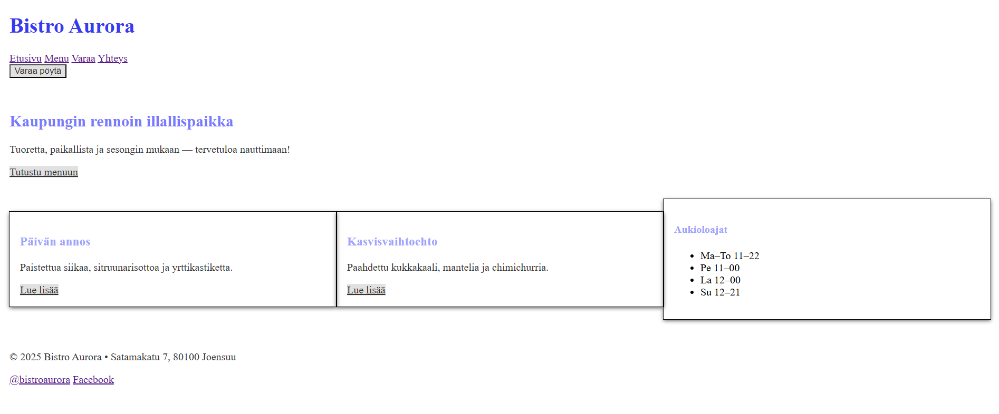

Scss ominaisuuksia käytetty:
- Mixineitä, kuten nappiMix ja cardMix. Käytin näitä mixejä, jotta pystyin eri asioille nopeasti antamaan samankaltaiset attribuutit. 
- Muuttujia. Tein muuttujat väreistä, joita käytin, sekä spacer muuttujan.
- Sisäkkäisiä valitsijoita, sekä & parent layout.scss tiedostossa.
- Importteja style.scss tiedostossa.
- Käytin darken funktiota nappiMixissä. Kun napin tai linkin päälle hoveraa ohjelmassa se tummenee 20%.
  
